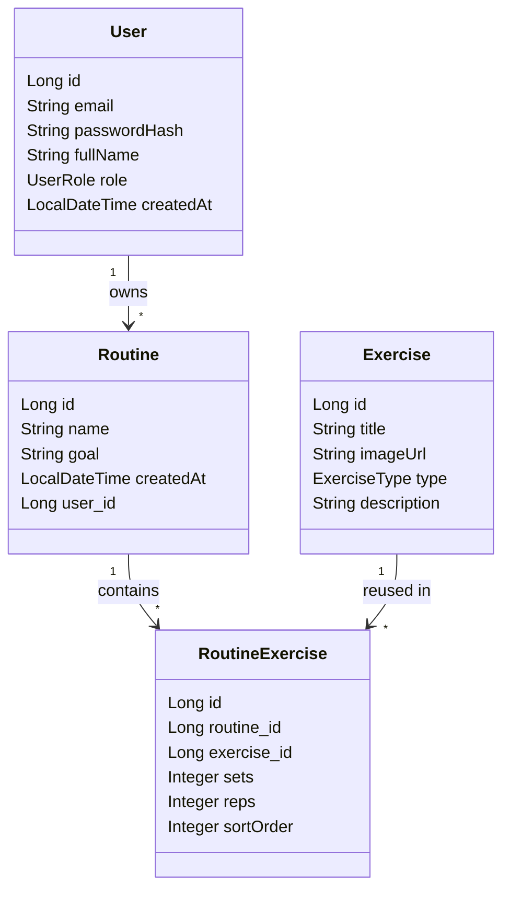

# Strive Backend - primeros pasos

## Requisitos funcionales (MVP)
- Gestionar dos tipos de usuario: `USER` y `ADMIN`.
- Mantener catalogo global de ejercicios creado por administracion.
- Crear rutinas personalizadas para un usuario a partir del catalogo.
- En cada ejercicio de rutina guardar: foto, titulo, series, repeticiones y orden.
- Listar ejercicios por tipo de entrenamiento/perfil.

## Requisitos no funcionales (MVP)
- API REST con Spring Boot 3 + JPA + MySQL.
- Validaciones de entrada en DTOs.
- Estructura por capas: `controller -> service -> repository -> domain`.
- Preparado para seguridad JWT en iteracion siguiente.

## Modelo de datos (diagrama de clases DB)

## Endpoints iniciales implementados
- `GET /api/exercises?type=STRENGTH`
- `POST /api/exercises`
- `GET /api/routines?ownerId=1`
- `POST /api/routines`

## Siguiente iteracion recomendada
1. Autenticacion JWT (`/api/auth/register`, `/api/auth/login`).
2. Permisos por rol (`ADMIN` gestiona catalogo, `USER` gestiona sus rutinas).
3. DTOs de respuesta para no exponer entidades JPA.
4. Paginacion y filtros avanzados de ejercicios.
5. Historial de entrenamientos completados (tracking real de progreso).
